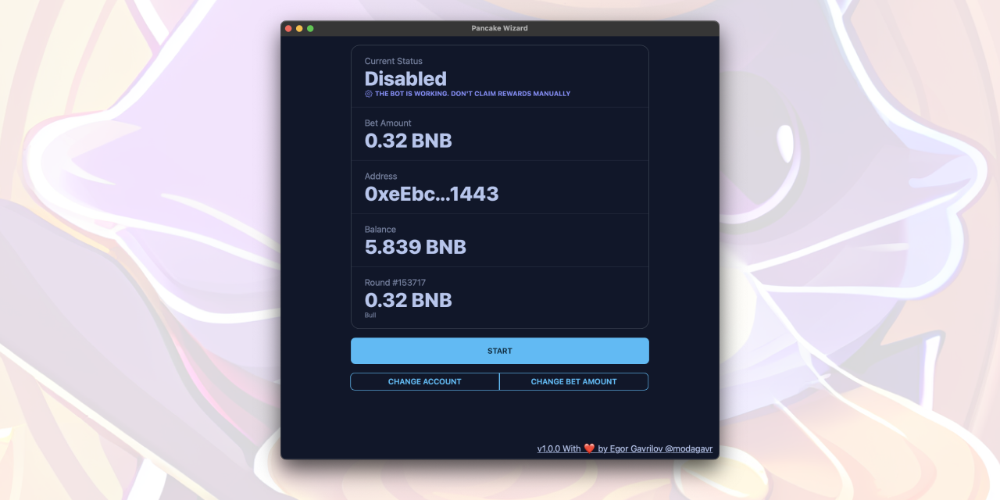
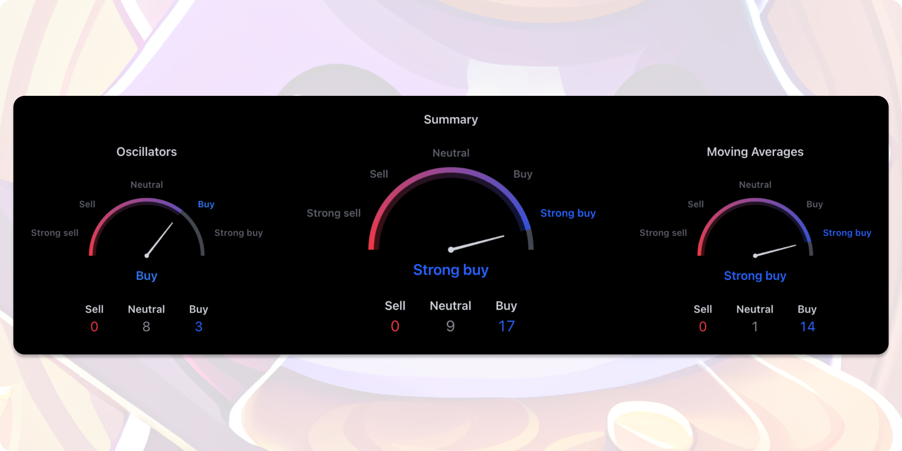

<div align="center">
  
</div>

<h1 align="center">Pancake Wizard</h1>

<p align="center">Bot for PancakeSwap Prediction – 26 technical indicators. Make smarter predictions with Pancake Wizard – trust math, not emotions!</p>

<p align=center>
  <a href="https://github.com/modagavr/pancake-wizard/releases/latest">Download</a> ·
  <a href="https://t.me/PancakeWizard">Telegram Group</a>
</p>

---

## Features

* 26 technical indicators
* Math-based analysis, not emotional decision-making
* Auto-bet
* Auto-claim
* User-friendly interface
* Desktop notifications
* Fast and lightweight



## [Download (Windows / Linux / macOS)](https://github.com/modagavr/pancake-wizard/releases/latest).

Note (macOS). If it shows that the app is broken do this:
1. Install `Pancake Wizard` the normal way by moving it to `Applications` folder
2. Open Terminal app
3. Run  
```
sudo xattr -r -d com.apple.quarantine /Applications/Pancake\ Wizard.app
```
4. Press `Enter`
5. Enter password and press `Enter`
6. Use the bot

## Technical Indicators Used



<div align="center">

| Oscillators                        | Moving Averages                     |
|------------------------------------|-------------------------------------|
| Relative Strength Index (14)       | Exponential Moving Average (10)     |
| Stochastic %K (14, 3, 3)           | Simple Moving Average (10)          |
| Commodity Channel Index (20)       | Exponential Moving Average (20)     |
| Average Directional Index (14)     | Simple Moving Average (20)          |
| Awesome Oscillator                 | Exponential Moving Average (30)     |
| Momentum (10)                      | Simple Moving Average (30)          |
| MACD Level (12, 26)                | Exponential Moving Average (50)     |
| Stochastic RSI Fast (3, 3, 14, 14) | Simple Moving Average (50)          |
| Williams Percent Range (14)        | Exponential Moving Average (100)    |
| Bull Bear Power                    | Simple Moving Average (100)         |
| Ultimate Oscillator (7, 14, 28)    | Exponential Moving Average (200)    |
|                                    | Simple Moving Average (200)         |
|                                    | Ichimoku Base Line (9, 26, 52, 26)  |
|                                    | Volume Weighted Moving Average (20) |
|                                    | Hull Moving Average (9)             |

</div>

## How to Export Private Key from MetaMask
- Open your account
- Click on three points at top-right corner
- Account details
- Export Private Key

## Contributing

Pancake Wizard is always looking for contributions, whether it's through bug reports, code, or new translations.

* If you find a bug in Pancake Wizard, or would like to suggest a new feature or enhancement, it'd be nice if you could [search your problem first](https://github.com/modagavr/pancake-wizard/issues); while i don't mind duplicates, keeping issues unique helps me save time and consolidates effort. If you can't find your issue, feel free to [file a new one](https://github.com/modagavr/pancake-wizard/issues/new/choose).

* Standard Plan includes plain 0.003 BNB fee **only from profits**

## [Download (Windows / Linux / macOS)](https://github.com/modagavr/pancake-wizard/releases/latest).

## Telegram Group [@PancakeWizard](https://t.me/PancakeWizard)
