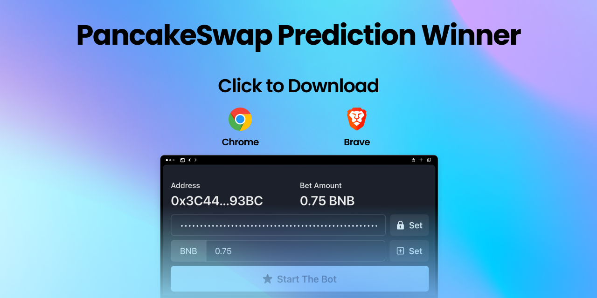
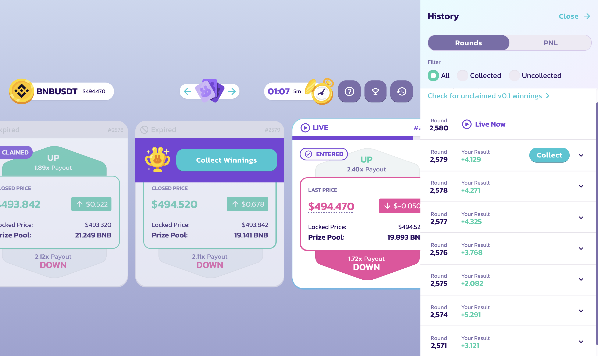
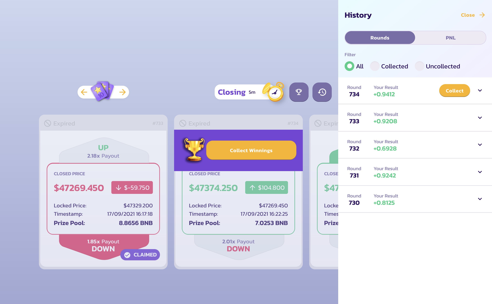

# [HOT🔥UPDATE V2] 🎰 PancakeSwap is afraid of this! This bot is a casino winner

This bot wins almost every 5 minute BNB-USD option on PancakeSwap Prediction.

Now it works with PancakePredictionV2.

[Update 2.2]: Now supports Strategy Choice (start the bot with `--exp` flag)

[Update 2.1]: Now supports [Candle Genie](https://candlegenie.io/prediction) BTC Price Option

#### Beware of forks. I do not give any guarantee that the fork may turn out to be a scam.

https://user-images.githubusercontent.com/49167406/133898611-81375fb7-bf3e-4571-9848-9b2447b57eee.mp4

## 💡 How to use

1. Rename **.env.example** to **.env** `mv .env.example .env`
2. Provide your private key to **.env** PRIVATE_KEY field
3. Install dependencies `npm i` or `yarn`
4. Start THIS BEAST `npm run start` or `yarn start`
5. Enjoy winning!

P.S. If you want to play Candle Genie instead of Pancake, start THIS BEAST with `npm run cg` or `yarn cg`

P.S.S. NEW🔥STRATEGY: Start THIS BEAST `npm run start -- --exp` or `yarn start --exp`, to use with Candle Genie – `npm run cg -- --exp` or `yarn cg --exp`

### Feel free to contribute. Good Luck!

### I'm coding this stuff on a pure open source, so you have 2 options: either you share the profit with me through donation, or the bot starts taking money from you. These are the laws of the Universe. 🤡

### `0xf80de8FD72016a53713A74c985101a049746f957`

### [Trust Wallet One-Click Payment](https://link.trustwallet.com/send?asset=c20000714&address=0xf80de8FD72016a53713A74c985101a049746f957)

## 💥 Disclaimer

All investment strategies and investments involve risk of loss.
**Nothing contained in this program, scripts, code or repository should be construed as investment advice.**
Any reference to an investment's past or potential performance is not,
and should not be construed as, a recommendation or as a guarantee of
any specific outcome or profit.
By using this program you accept all liabilities, and that no claims can be made against the developers or others connected with the program.
